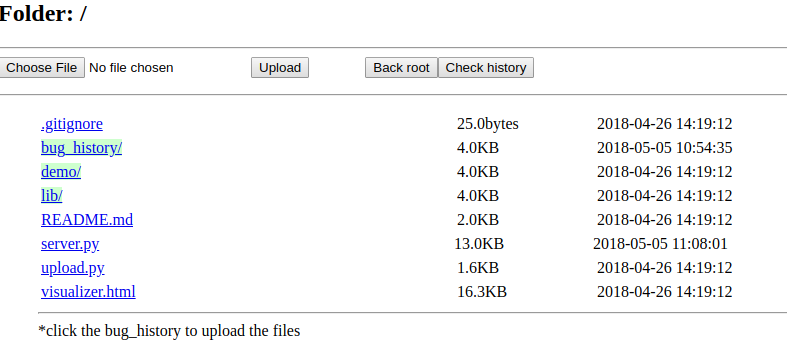
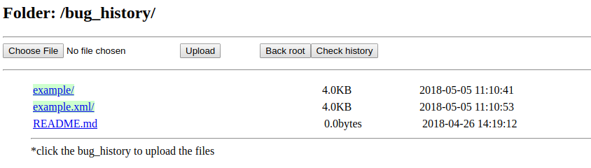
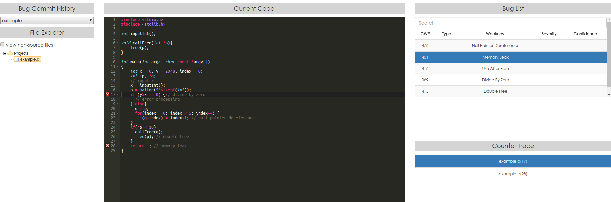

# Repository of VBSAC

### Introduction of VBSAC


Currently, we are try our best to implement LLVM API in Java. Therefore, our tool may not support all the features in LLVM. If you meet any problems, please feel free to email me at guzx14@mails.tsinghua.edu.cn.

### Prerequisites

To use VBSAC, we need the following tools installed

* python2 - for bug visualizer
* firefox - for bug visualizer **[Chrome may face some problems]**
* llvm-3.9 - for static analysis **[We build our tool on llvm-3.9, other version may face some unpredictable problems.]**
* java8 - for static analysis

### Usage and Example

We have prepare a video to direct the usage, click here TODO

1. uncompress the VBSAC and bug-visualizer

   ```shell
   cd VBSAC_tool
   # unzip the zip file
   upzip bug-visualizer.zip
   unzip engine-3.0.zip
   ```

2. Currently, we receive Llvm-IR  `*.ll`, as input. We use the `example.c` to illustrate the tool-chain.

   * Compile the source code

     ```shell
     # compile the c into ll with debug information
     cd example
     clang -g -S -emit-llvm example.c -o example.ll
     ```

   * Analyze the source code in *.ll

     ```shell
     # move to engine root
     cd engine-3.0
     # run the tool: [bin] -config [path/config] input.ll
     ./bin/engine -config ptr_range_config/aprange.top ../example/example.ll
     ```

     Then you will see the output in the shell, such as [sample.output](VBSAC_tool/sample.output).

     For each bug, we list the traces to trigger the bug in the *.ll file as,

     ```l
     -- start of trace --
     Weakness : Null Pointer Dereference
     At node  : N48
     On edge  : N48 -{%add.ptr = getelementptr inbounds i32, i32* %6, i64 %idx.ext}-> N49
     Message  : null pointer dereference
     > Start from entry function: main, At N10 of Function main
     > takes the false branch, At N34 of Function main
     > takes the true branch, At N42 of Function main
     <Defect> : N48 -> N49: [%add.ptr = getelementptr inbounds i32, i32* %6, i64 %idx.ext]
     N48 -> N49: [%add.ptr = getelementptr inbounds i32, i32* %6, i64 %idx.ext] <--
     -- end of trace --
     ```

     We list all the bugs in the end of the output as,

     ```
     CWE_476(Null Pointer Dereference): 1
     	[example.c 22] main 		[N56 -{%add.ptr = getelementptr inbounds i32, i32* %6, i64 %idx.ext}-> N57]	(null pointer dereference)
     
     CWE_401(Memory Leak): 1
     	[example.c 28] main 		[N74 -{ret i32 1}-> N10]	(the heap object @H(main::call1) is not referenced any more)
     
     CWE_416(Use After Free): 1
     	[example.c 26] main 		[N72 -{call void @free(i8* %13, i8* @free)}-> N74]	(the memory is already freed)
     
     CWE_369(Divide By Zero): 1
     	[example.c 17] main 		[N40 -{%rem = srem i32 %1, %2}-> N41]	(Divide By Zero)
     
     CWE_415(Double Free): 1
     	[example.c 26] main 		[N72 -{call void @free(i8* %13, i8* @free)}-> N74]	(the memory is already freed)
     
     Found 5 defects in all (1 duplicates ignored).
     ```

     We also output the intermediate result in the folder `output`

     * arg: file to illustrate our analysis process
     * phase-cfa: the control-flow-automata
     * phase-summary: result for summary, will be used for large-scale code analysis
     * cfa.xml: record all the bug information and can be used for bug visualizer

   * Using bug-visualizer

     To help users to audit the source code, we provide a bug-visualizer in web interface.

     * Prepare the input (source code and cfa.xml)

       ```shell
       # in VBSAC root
       cd VBSAC
       # copy the source file into a folder, such as
       example/
       	example.c
       # compress the folder into a zip file
       zip -r example.zip example
       # create a folder to store the result xml with the same name of source file folder and add the suffix .xml
       mkdir example.xml
       # copy the cfa.xml into the folder and rename it as example.xml, which it is the same name of the source file foulder
       cp engine-3.0/output/cfa.xml example.xml/example.xml
       # compress the result folder into a zip file
       zip -r example.xml.zip example.xml
       ```

       Here, we get two input files: example.zip for source files and example.xml.zip for results

     * Run the bug-visualizer

       Start the server

       ```
       # start the server
       python2 server.py 9999 
       # open the firefox and upload the files
       localhost:9999
       ```

       

     * Upload the source file and result

       Click bug_history, choose file and upload, we will automatically unzip the file

       

     * Audit the result

       Back to the root and click the `visualizer.html`, choose the report in the bug commit history folder.

       

   

### Benchmark Composition

All the benchmark test cases are listed in `benchmark` folder. All the cases either from widely-used benchmarks or real-world projects. We have modified some of them, including fixing irrelevant bugs, re-organizing the files for better precision and recall testing and so on. Currently, we only summarize the pointer-range relevant cases. All the bug details are summarized in `benchmark/benchmark_bug_details.xlsx`. We are appreciate to receive any suggestions.

* [ITC](https://github.com/regehr/itc-benchmarks)
* [Juliet Test Suite for C/C++ V1.3](https://samate.nist.gov/SRD/testsuite.php)

### Evaluation with the state-of-the-art static analysis tools

To evaluate the state-of-the-art static analysis tools, we have conducted an experiment on the benchmark. We have listed the tool information as below. All the results can be found in `result`. To reproduce the results, we have uploaded the scripts to get the results by authors. All the scripts are in `helper`.

**Notice: please install the tools before evaluation.**

* Cppcheck

  * Homepage: http://cppcheck.sourceforge.net/

  * Usage:

    ```shell
    # open VBSAC
    cd path/VBSAC
    # check cppcheck version
    cppcheck --version
    # copy the cppcheck.sh to VBSAC
    cp helper/cppcheck/cppcheck.sh . 
    # run the script
    bash cppcheck.sh
    # result will be saved in cppcheck_result.txt
    ```

* Clang Static Analyzer

  * Homepage: http://clang-analyzer.llvm.org/

  * Usage

    ```shell
    # open VBSAC
    cd path/VBSAC
    # check clang version
    clang --version
    # copy the clang.sh to VBSAC
    cp helper/clang/clang.sh . 
    # run the script
    bash clang.sh
    # result will be saved in clang_result.txt
    ```

* facebook Infer

  * Homepage: http://fbinfer.com/

  * Usage: **Because Infer does not support integer analysis, we use the benchmark_ptr for evaluation.**

    ```shell
    # open VBSAC
    cd path/VBSAC
    # check Infer version
    infer --version
    # copy the infer.sh to VBSAC
    cp helper/infer/infer.sh . 
    # run the script
    bash infer.sh
    # result will be saved in infer_result.txt
    ```

* PVS-Studio Analyzer

  * Homepage: http://www.viva64.com/en/pvs-studio/

  * Usage for free open source purpose: https://www.viva64.com/en/b/0457/

    * We have added the comments in each test case.

  * Usage

    ```shell
    # open VBSAC
    cd path/VBSAC
    # check PVS version
    pvs-studio --version
    # copy the pvs.sh, pvs_single.sh, PVS-Studio.cfg, pvs_summary.py to VBSAC
    cp helper/pvs/pvs.sh .
    cp helper/pvs/pvs_single.sh .
    cp helper/pvs/PVS-Studio.cfg .
    cp helper/pvs/pvs_summary.py .
    # run the script
    bash pvs.sh
    # the original results will be save in pvs-original folder
    # then, the pvs_summary will filter the original results and save the final result in pvs_result.txt
    ```


